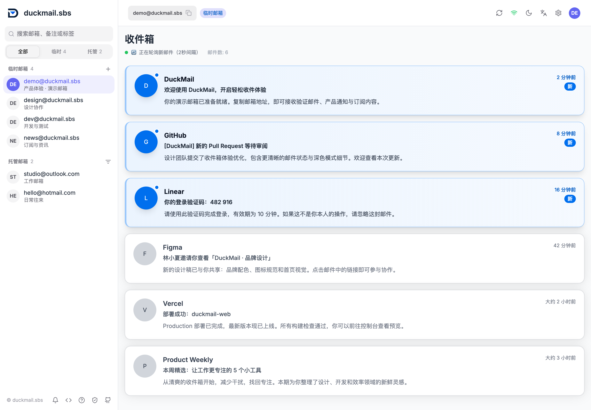

<div align="center">
  <picture>
    <source media="(prefers-color-scheme: dark)" srcset="./public/images/duckmail-logo-on-dark.png">
    
  </picture>
  <h1>DuckMail</h1>
  <p>A web client for temporary email and Microsoft hosted mailboxes.</p>
  <p>
    <a href="https://duckmail.sbs">Try DuckMail</a> ·
    <a href="https://www.duckmail.sbs/en/api-docs">API docs</a> ·
    <a href="https://domain.duckmail.sbs">Management panel</a> ·
    <a href="./README.md">中文</a>
  </p>
</div>

<picture>
  <source media="(prefers-color-scheme: dark)" srcset="./img/duckmail-dark.png">
  
</picture>

## Features

- **Temporary email**: Generate an address instantly, or choose an address, password and account lifetime.
- **Hosted mailboxes**: Access connected Microsoft mailboxes with an independent access password or an owner API Key. View messages and sync status.
- **Multiple mailboxes**: Switch and search accounts; filter by type, domain or hosting status.
- **Message reader**: Automatically refresh inboxes, read messages and download attachments or original emails.
- **Interface**: Chinese and English, light and dark themes, and mobile layouts.

Built with Next.js, React, TypeScript and HeroUI. This repository provides the web interface and API proxy; a separate backend receives and stores mail. It connects to DuckMail API by default. Enable Mail.tm or add a compatible provider in settings.

## Quick start

Visit [duckmail.sbs](https://duckmail.sbs) to create a temporary mailbox. Public domains require no API Key.

For private domains or access to hosted mailboxes you own, create an API Key in the [management panel](https://domain.duckmail.sbs), then enter it under **Settings → API Key**. A hosted mailbox's independent access password is set by its owner and differs from the Microsoft account password.

## Deployment

### Docker

```bash
docker run -d \
  --name duckmail-web \
  --restart unless-stopped \
  -p 3000:3000 \
  syferie/duckmail-web:latest
```

Open [http://localhost:3000](http://localhost:3000). After cloning the repository, you can also use the included [docker-compose.yml](./docker-compose.yml):

```bash
docker compose up -d
```

### Vercel / Netlify

[](https://vercel.com/new/clone?repository-url=https://github.com/moonwesif/duckmail)
[](https://app.netlify.com/start/deploy?repository=https://github.com/moonwesif/duckmail)

The deployment must support the Next.js server runtime and reach the selected mail API. Use HTTPS in production and localhost for local development.

## Local development

Requires Node.js **20.9+** and pnpm. The repository's Docker build uses Node.js 22 and pnpm 10.

```bash
git clone https://github.com/moonwesif/duckmail.git
cd duckmail
pnpm install --frozen-lockfile
pnpm dev
```

Open [http://localhost:3000](http://localhost:3000). Build with `pnpm build`; the Docker image runs the bundled standalone server.

## Usage notes

- Mailbox lists, login state and API Keys are stored in the current browser. Clearing site data requires signing in again; save temporary mailbox addresses and passwords yourself.
- Temporary accounts created in the web UI do not expire by default. Message retention is controlled by the backend and is independent of account lifetime.
- Use the backend API for programmatic access. The Web routes `/api/mail` and `/api/sse` check for same-origin browser requests; ordinary direct script requests receive `403`.

See the [API docs](https://www.duckmail.sbs/en/api-docs) for endpoints, authentication and rate limits. A [plain-text API reference for AI assistants](./public/llm-api-docs.txt) is also available.

## Feedback and support

Report bugs through [Issues](https://github.com/moonwesif/duckmail/issues) or submit a pull request. Contact: [syferie@proton.me](mailto:syferie@proton.me) · Sponsor: [Afdian](https://afdian.com/a/syferie).

## License

[MIT](./LICENSE).
